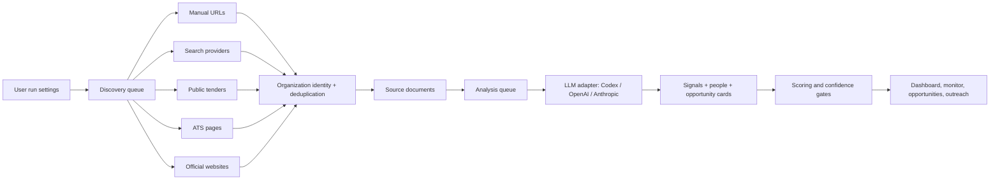

<div align="center">

# Opportunity Radar

### Evidence-aware client acquisition for AI automation builders

Opportunity Radar turns public business signals into a local intelligence workspace for discovering companies that may need

**AI automation, document intelligence, reliable RAG, workflow engineering, or LLM assurance** before the opportunity is obvious.

<br />

<a href="https://fanzizakariae.github.io/Opportunity_Radar/">
  
</a>
&nbsp;
<a href="#system-architecture">
  
</a>
&nbsp;
<a href="mailto:zakariafanzi3@gmail.com">
  
</a>

<br /><br />


</div>

<br />

> [!IMPORTANT]
> **Portfolio transparency:** the GitHub Pages experience is a static demonstration built from sample data. It does not run web research, contact companies, call AI APIs, or send outreach. This repository contains the functional local Next.js application with queues, connectors, provider adapters, scoring, persistence, and tests.

---

## The problem behind the product

Freelancers, consultants, and small AI teams usually discover opportunities too late. By the time a company posts a public request or receives many vendor pitches, the conversation is already crowded. Generic lead lists do not solve the problem because they are noisy, shallow, and disconnected from the builder's actual services.

<table>
  <tr>
    <td width="33%" align="center">
      <h3>Signals are fragmented</h3>
      <p>Useful clues live across official sites, public tenders, job posts, provider directories, and search results.</p>
    </td>
    <td width="33%" align="center">
      <h3>Lead lists are weak</h3>
      <p>A company name is not enough. The system must explain why the opportunity is credible.</p>
    </td>
    <td width="33%" align="center">
      <h3>Outreach needs context</h3>
      <p>The first message should be tied to public evidence, not a generic cold pitch.</p>
    </td>
  </tr>
</table>

Opportunity Radar is built around one practical idea: **discover public signals, qualify them with evidence, and prepare outreach that remains reviewable by a human.**

---

## What a client can see in this project

<table>
  <tr>
    <td width="50%">
      <h3>Multi-source discovery</h3>
      <p>Research runs can combine manual URLs, Exa, Tavily, BOAMP, TED, France Num, Greenhouse, Lever, official websites, and bounded Firecrawl fallback extraction.</p>
    </td>
    <td width="50%">
      <h3>Evidence-backed opportunity cards</h3>
      <p>Each card captures the need, why now, service fit, confidence, supporting public evidence, buyer role, outreach angle, and lifecycle state.</p>
    </td>
  </tr>
  <tr>
    <td width="50%">
      <h3>Provider-neutral AI layer</h3>
      <p>The analysis contract works with Codex CLI, OpenAI, or Anthropic through one structured JSON interface and one evidence policy.</p>
    </td>
    <td width="50%">
      <h3>Local queue control</h3>
      <p>Discovery and analysis are separated into persistent queue items so runs can be monitored, paused, resumed, retried, or inspected.</p>
    </td>
  </tr>
  <tr>
    <td width="50%">
      <h3>Commercial service matching</h3>
      <p>The radar maps signals to concrete offers: Document AI, Reliable RAG, AI Workflow Automation, and LLM Assurance.</p>
    </td>
    <td width="50%">
      <h3>Human-in-the-loop outreach</h3>
      <p>The app drafts hooks, short messages, long messages, follow-ups, and opening questions, but never sends anything automatically.</p>
    </td>
  </tr>
</table>

---

## From capability to business value

| Engineering capability | Practical value |
|---|---|
| Public-source discovery queues | Keeps sourcing active without turning the app into an uncontrolled scraper |
| Evidence quality checks | Reduces noisy leads and weak company matches |
| Service-catalog scoring | Matches opportunities to real delivery offers, not vague AI interest |
| Provider-neutral LLM adapter | Lets the same workflow run through Codex CLI, OpenAI, or Anthropic |
| Contact verification rules | Avoids guessed email patterns and unsupported person claims |
| Pipeline state tracking | Turns research output into a usable business-development workflow |
| Static public demo | Lets visitors inspect the product experience without secrets or API calls |

---

## System architecture



<p align="center">
  <strong>Raw discovery is not treated as a lead until the evidence survives validation.</strong>
</p>

---

## Evidence and safety design

| Control | Purpose |
|---|---|
| **Official-source preference** | Company sites, public postings, and official datasets are weighted above weak aggregators |
| **Source URL validation** | Model outputs must reference supplied public sources, not invented URLs |
| **Signal excerpts** | Important claims keep short supporting fragments for review |
| **Service-fit scoring** | The system scores actual commercial relevance, not generic AI excitement |
| **Confidence separation** | Opportunity strength and evidence confidence are kept as separate concepts |
| **No LinkedIn automation** | LinkedIn is not scraped or automated |
| **No automatic sending** | Outreach drafts stay human-reviewed |
| **Local runtime storage** | Runtime databases, queues, and generated data remain outside the public repo |

---

## Opportunity types

| Service track | What the radar looks for | Example signals |
|---|---|---|
| **Document Intelligence and OCR** | Manual document processing, invoices, delivery notes, PDFs, ERP entry | invoice extraction, document validation, Odoo/ERP workflows |
| **Reliable RAG and Knowledge Assistants** | Internal knowledge scattered across documents or teams | RAG, knowledge base, citations, technical support search |
| **AI Workflow and API Automation** | Repetitive operations across email, CRM, spreadsheets, and APIs | n8n, API integrations, lead handling, workflow recovery |
| **LLM Security and Evaluation** | AI teams needing quality gates and prompt-injection testing | guardrails, evaluation, red team, hallucination checks |

---

## Repository tour

```text
Opportunity_Radar/
+-- app/                         Next.js routes, API endpoints, dashboard pages
|   +-- api/                     Status, research runs, opportunities, settings
|   +-- companies/               Company intelligence view
|   +-- monitor/                 Queue and run monitoring
|   +-- opportunities/           Evidence-backed opportunity cards
|   +-- outreach/                Drafted outreach workspace
|   +-- settings/                Providers, sources, boundaries
+-- components/                  Shared interface components
+-- lib/                         Core engine, queues, scoring, source connectors, LLM adapters
+-- tests/                       Vitest coverage for queues, scoring, connectors, providers
+-- scripts/                     Cross-platform Next.js launcher
+-- Demo/                        Static GitHub Pages build
+-- .github/workflows/           Demo deployment workflow
```

---

<details open>
<summary><strong>Run the local application</strong></summary>

### Requirements

- Windows, macOS, or Linux
- Node.js 22 or newer
- npm
- Optional: Codex CLI authenticated with `codex login`
- Optional: API keys for Exa, Tavily, Firecrawl, OpenAI, or Anthropic

```powershell
cd "C:\path\to\Opportunity_Radar"
Copy-Item .env.example .env.local
npm install
npm run dev
```

Open:

```text
http://127.0.0.1:3000
```

If port `3000` is already busy:

```powershell
npm run dev -- -p 3001
```

</details>

<details>
<summary><strong>Configure intelligence providers</strong></summary>

All local configuration belongs in `.env.local`. Keep `.env.example` committed, but never commit real keys.

```dotenv
# Local/default path through your authenticated Codex CLI session
OPPORTUNITY_RADAR_LLM_PROVIDER=codex
OPPORTUNITY_RADAR_CODEX_ENABLED=true

# Optional cloud providers
OPENAI_API_KEY=
ANTHROPIC_API_KEY=

# Optional discovery providers
EXA_API_KEY=
TAVILY_API_KEY=
FIRECRAWL_API_KEY=
```

Fallback providers are optional and should be configured intentionally so the app does not silently spend paid API credits.

</details>

<details>
<summary><strong>Validate the implementation</strong></summary>

```powershell
npm run lint
npm test
npm run build
```

The automated tests cover database queues, scoring, provider configuration, JSON extraction, geography filtering, discovery quality, and connector parsing with mocked inputs.

</details>

---

## Real implementation vs. public demonstration

| Capability | Local Next.js application | GitHub Pages demo |
|---|:---:|:---:|
| Public-source discovery | Yes, with configured providers | Simulated |
| Queue execution and monitoring | Yes | Pre-rendered sample state |
| Codex/OpenAI/Anthropic calls | Yes, with credentials | Disabled |
| SQLite persistence | Yes | Static data only |
| Opportunity scoring | Yes | Illustrated |
| Outreach drafting | Yes | Pre-scripted |
| Safe to explore without setup or keys | Requires local setup | Yes |

---

## Public publishing boundary

This repository is intended to be shareable as a public engineering project. Keep these files out of commits:

| Exclude | Why |
|---|---|
| `.env.local` | Contains private credentials and local settings |
| `data/` | Runtime databases, queues, and generated source documents |
| `.next/` | Local Next.js build output |
| `node_modules/` | Installed dependencies |
| `*.log` | Local execution traces and possible sensitive snippets |

The committed `Demo/` folder is safe because it is a static portfolio build with sample data.

---

<div align="center">

## Built by Zakariae Fanzi

**AI Automation & Document Intelligence Engineer**<br />
RAG | AI Agents | Workflow Automation | OCR | LLM Evaluation

<a href="https://www.linkedin.com/in/zakariae-fanzi/">
  
</a>
&nbsp;
<a href="https://fanzizakariae.github.io/">
  
</a>
&nbsp;
<a href="mailto:zakariafanzi3@gmail.com">
  
</a>

<br /><br />

<sub>Available for AI engineering opportunities and selected projects involving research automation, document intelligence, reliable RAG, and evidence-grounded workflows.</sub>

</div>
